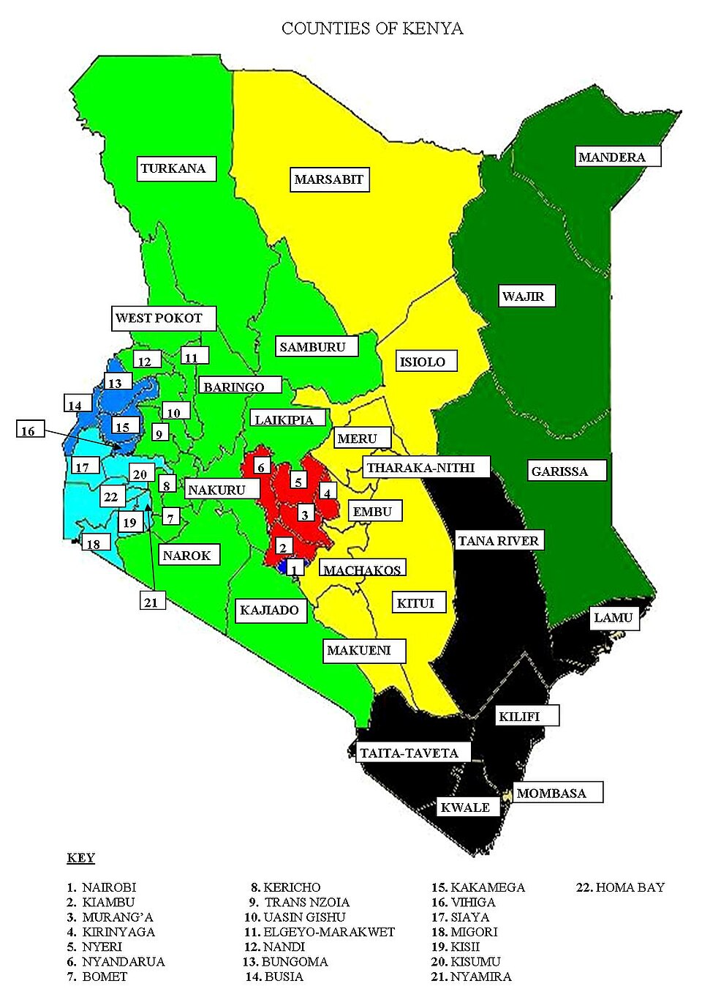
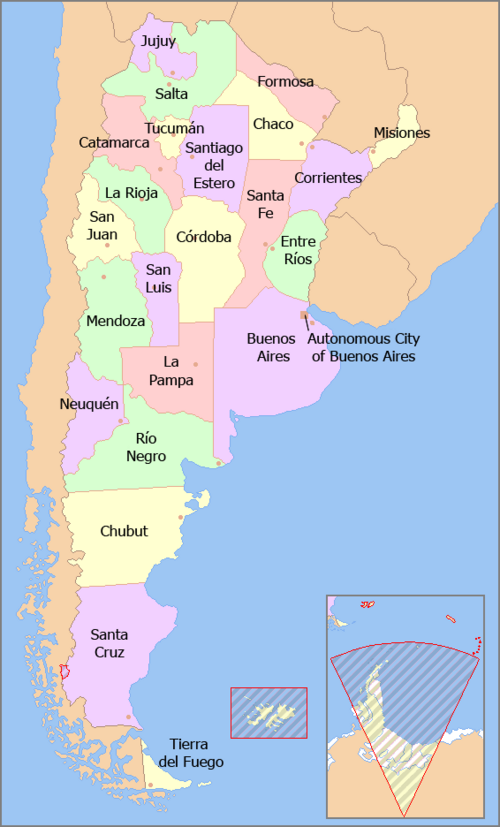

Welcome! You have arrived at Population Divided: An Admin Survey.

The purpose of this project is to try to figure out weather there is a causal relationship between the number of highest-level administrative divisons in a particular nation-state and other common nation statstics, such as total population, number of major ethnic groups, or sqaure area.  For this project, I have chosen three countries: Kenya, Thailand, and Argentina. The countries are all on different continents,  have different economies and all have a unqiue relationships to major ethnic groups. 

# Hypothesis 

Before I began working on this project, I proposed a hypothesis that the number of highest-level administrative divisions in a nation is directly scaleable to either the total population or the number of major ethnic groups. 

## Explaining Terms

Before we get into the data and case study countries I will be defining terms. In this project, "highest-level administrative divisions" refers to the largest administrative divisions in a nation that holds self-governing powers. For a country such as Kenya, with a somewhat devolved/decentralized government, this refers to the 47 counties. In regards to 'major ethnic groups', this project will define a major ethnic group as an ethnic group which consists of at least ~2% of the total population of the nation I am examining.

## Project Process and Code 

I first began writing the code to this project by using pandas to create three API calls which brought back the total list of Admin Divisions for the country I called based on  the two-digit ISO-3166 code for the nation. The html the API call takes from looks like this, using Argentina as an example . The Administrative Divisons API I used for the begining section of the project come from Geonames.org. 

When formated into a dataframe, the data is formated like this: 

 

## The Master List 

After pulling out the administrative divison tables for my three example nations, I turned to webscrapping to create a 'master list' with all the information I need about any given country. 

<html>
<head>
<meta charset="utf-8" />
</head>
<body>
<table>
<tr><th>ISO-3166</th><th>fips</th><th>Country</th><th>Capital</th><th>Area in km²</th><th>Population</th></tr>
<tr><td></td><td></td><td></td><td></td><td></td><td></td></tr>
<tr><td>AD</td><td>AN</td><td>Andorra</td><td>Andorra la Vella</td><td>468</td><td>77006</td></tr>
<tr><td>AE</td><td>AE</td><td>United Arab Emirates</td><td>Abu Dhabi</td><td>82880</td><td>9630959</td></tr>
<tr><td>AF</td><td>AF</td><td>Afghanistan</td><td>Kabul</td><td>647500</td><td>37172386</td></tr>
<tr><td>AG</td><td>AC</td><td>Antigua and Barbuda</td><td>St. John&apos;s</td><td>443</td><td>96286</td></tr>
<tr><td>AI</td><td>AV</td><td>Anguilla</td><td>The Valley</td><td>102</td><td>13254</td></tr>
<tr><td>AL</td><td>AL</td><td>Albania</td><td>Tirana</td><td>28748</td><td>2866376</td></tr>
<tr><td>AM</td><td>AM</td><td>Armenia</td><td>Yerevan</td><td>29800</td><td>3084400</td></tr>
<tr><td>AO</td><td>AO</td><td>Angola</td><td>Luanda</td><td>1246700</td><td>30809762</td></tr>
<tr><td>AQ</td><td>AY</td><td>Antarctica</td><td>Luanda</td><td>14000000</td><td>0</td></tr>
<tr><td>AR</td><td>AR</td><td>Argentina</td><td>Buenos Aires</td><td>2766890</td><td>44494502</td></tr>
<tr><td>AS</td><td>AQ</td><td>American Samoa</td><td>Pago Pago</td><td>199</td><td>55465</td></tr>
<tr><td>AT</td><td>AU</td><td>Austria</td><td>Vienna</td><td>83858</td><td>8847037</td></tr>
<tr><td>AU</td><td>AS</td><td>Australia</td><td>Canberra</td><td>7686850</td><td>24992369</td></tr>
<tr><td>AW</td><td>AA</td><td>Aruba</td><td>Oranjestad</td><td>193</td><td>105845</td></tr>
<tr><td>AX</td><td>AX</td><td>Åland</td><td>Mariehamn</td><td>1580</td><td>26711</td></tr>
<tr><td>AZ</td><td>AJ</td><td>Azerbaijan</td><td>Baku</td><td>86600</td><td>10224900</td></tr>
<tr><td>BA</td><td>BK</td><td>Bosnia and Herzegovina</td><td>Sarajevo</td><td>51129</td><td>3323929</td></tr>
<tr><td>BB</td><td>BB</td><td>Barbados</td><td>Bridgetown</td><td>431</td><td>286641</td></tr>
<tr><td>BD</td><td>BG</td><td>Bangladesh</td><td>Dhaka</td><td>144000</td><td>161356039</td></tr>
<tr><td>BE</td><td>BE</td><td>Belgium</td><td>Brussels</td><td>30510</td><td>11422068</td></tr>
<tr><td>BF</td><td>UV</td><td>Burkina Faso</td><td>Ouagadougou</td><td>274200</td><td>19751535</td></tr>
<tr><td>BG</td><td>BU</td><td>Bulgaria</td><td>Sofia</td><td>110910</td><td>7000039</td></tr>
<tr><td>BH</td><td>BA</td><td>Bahrain</td><td>Manama</td><td>665</td><td>1569439</td></tr>
<tr><td>BI</td><td>BY</td><td>Burundi</td><td>Gitega</td><td>27830</td><td>11175378</td></tr>
<tr><td>BJ</td><td>BN</td><td>Benin</td><td>Porto-Novo</td><td>112620</td><td>11485048</td></tr>
<tr><td>BL</td><td>TB</td><td>Saint Barthélemy</td><td>Gustavia</td><td>21</td><td>8450</td></tr>
<tr><td>BM</td><td>BD</td><td>Bermuda</td><td>Hamilton</td><td>53</td><td>63968</td></tr>
<tr><td>BN</td><td>BX</td><td>Brunei</td><td>Bandar Seri Begawan</td><td>5770</td><td>428962</td></tr>
<tr><td>BO</td><td>BL</td><td>Bolivia</td><td>Sucre</td><td>1098580</td><td>11353142</td></tr>
<tr><td>BQ</td><td>BQ</td><td>Bonaire, Sint Eustatius, and Saba</td><td>Sucre</td><td>328</td><td>18012</td></tr>
<tr><td>BR</td><td>BR</td><td>Brazil</td><td>Brasilia</td><td>8511965</td><td>209469333</td></tr>
<tr><td>BS</td><td>BF</td><td>Bahamas</td><td>Nassau</td><td>13940</td><td>385640</td></tr>
<tr><td>BT</td><td>BT</td><td>Bhutan</td><td>Thimphu</td><td>47000</td><td>754394</td></tr>
<tr><td>BV</td><td>BV</td><td>Bouvet Island</td><td>Thimphu</td><td>49</td><td>0</td></tr>
<tr><td>BW</td><td>BC</td><td>Botswana</td><td>Gaborone</td><td>600370</td><td>2254126</td></tr>
<tr><td>BY</td><td>BO</td><td>Belarus</td><td>Minsk</td><td>207600</td><td>9485386</td></tr>
<tr><td>BZ</td><td>BH</td><td>Belize</td><td>Belmopan</td><td>22966</td><td>383071</td></tr>
<tr><td>CA</td><td>CA</td><td>Canada</td><td>Ottawa</td><td>9984670</td><td>37058856</td></tr>
<tr><td>CC</td><td>CK</td><td>Cocos (Keeling) Islands</td><td>West Island</td><td>14</td><td>628</td></tr>
<tr><td>CD</td><td>CG</td><td>DR Congo</td><td>Kinshasa</td><td>2345410</td><td>84068091</td></tr>
<tr><td>CF</td><td>CT</td><td>Central African Republic</td><td>Bangui</td><td>622984</td><td>4666377</td></tr>
<tr><td>CG</td><td>CF</td><td>Congo Republic</td><td>Brazzaville</td><td>342000</td><td>5244363</td></tr>
<tr><td>CH</td><td>SZ</td><td>Switzerland</td><td>Bern</td><td>41290</td><td>8516543</td></tr>
<tr><td>CI</td><td>IV</td><td>Ivory Coast</td><td>Yamoussoukro</td><td>322460</td><td>25069229</td></tr>
<tr><td>CK</td><td>CW</td><td>Cook Islands</td><td>Avarua</td><td>240</td><td>21388</td></tr>
<tr><td>CL</td><td>CI</td><td>Chile</td><td>Santiago</td><td>756950</td><td>18729160</td></tr>
<tr><td>CM</td><td>CM</td><td>Cameroon</td><td>Yaounde</td><td>475440</td><td>25216237</td></tr>
<tr><td>CN</td><td>CH</td><td>China</td><td>Beijing</td><td>9596960</td><td>1411778724</td></tr>
<tr><td>CO</td><td>CO</td><td>Colombia</td><td>Bogota</td><td>1138910</td><td>49648685</td></tr>
<tr><td>CR</td><td>CS</td><td>Costa Rica</td><td>San Jose</td><td>51100</td><td>4999441</td></tr>
<tr><td>CU</td><td>CU</td><td>Cuba</td><td>Havana</td><td>110860</td><td>11338138</td></tr>
<tr><td>CV</td><td>CV</td><td>Cabo Verde</td><td>Praia</td><td>4033</td><td>543767</td></tr>
<tr><td>CW</td><td>UC</td><td>Curaçao</td><td>Willemstad</td><td>444</td><td>159849</td></tr>
<tr><td>CX</td><td>KT</td><td>Christmas Island</td><td>Flying Fish Cove</td><td>135</td><td>1500</td></tr>
<tr><td>CY</td><td>CY</td><td>Cyprus</td><td>Nicosia</td><td>9250</td><td>1189265</td></tr>
<tr><td>CZ</td><td>EZ</td><td>Czechia</td><td>Prague</td><td>78866</td><td>10625695</td></tr>
<tr><td>DE</td><td>GM</td><td>Germany</td><td>Berlin</td><td>357021</td><td>82927922</td></tr>
<tr><td>DJ</td><td>DJ</td><td>Djibouti</td><td>Djibouti</td><td>23000</td><td>958920</td></tr>
<tr><td>DK</td><td>DA</td><td>Denmark</td><td>Copenhagen</td><td>43094</td><td>5797446</td></tr>
<tr><td>DM</td><td>DO</td><td>Dominica</td><td>Roseau</td><td>754</td><td>71625</td></tr>
<tr><td>DO</td><td>DR</td><td>Dominican Republic</td><td>Santo Domingo</td><td>48730</td><td>10627165</td></tr>
<tr><td>DZ</td><td>AG</td><td>Algeria</td><td>Algiers</td><td>2381740</td><td>42228429</td></tr>
<tr><td>EC</td><td>EC</td><td>Ecuador</td><td>Quito</td><td>283560</td><td>17084357</td></tr>
<tr><td>EE</td><td>EN</td><td>Estonia</td><td>Tallinn</td><td>45226</td><td>1320884</td></tr>
<tr><td>EG</td><td>EG</td><td>Egypt</td><td>Cairo</td><td>1001450</td><td>98423595</td></tr>
<tr><td>EH</td><td>WI</td><td>Western Sahara</td><td>El-Aaiun</td><td>266000</td><td>273008</td></tr>
<tr><td>ER</td><td>ER</td><td>Eritrea</td><td>Asmara</td><td>121320</td><td>6209262</td></tr>
<tr><td>ES</td><td>SP</td><td>Spain</td><td>Madrid</td><td>504782</td><td>46723749</td></tr>
<tr><td>ET</td><td>ET</td><td>Ethiopia</td><td>Addis Ababa</td><td>1127127</td><td>109224559</td></tr>
<tr><td>FI</td><td>FI</td><td>Finland</td><td>Helsinki</td><td>337030</td><td>5518050</td></tr>
<tr><td>FJ</td><td>FJ</td><td>Fiji</td><td>Suva</td><td>18270</td><td>883483</td></tr>
<tr><td>FK</td><td>FK</td><td>Falkland Islands</td><td>Stanley</td><td>12173</td><td>2638</td></tr>
<tr><td>FM</td><td>FM</td><td>Micronesia</td><td>Palikir</td><td>702</td><td>112640</td></tr>
<tr><td>FO</td><td>FO</td><td>Faroe Islands</td><td>Torshavn</td><td>1399</td><td>48497</td></tr>
<tr><td>FR</td><td>FR</td><td>France</td><td>Paris</td><td>547030</td><td>66987244</td></tr>
<tr><td>GA</td><td>GB</td><td>Gabon</td><td>Libreville</td><td>267667</td><td>2119275</td></tr>
<tr><td>GB</td><td>UK</td><td>United Kingdom</td><td>London</td><td>244820</td><td>66488991</td></tr>
<tr><td>GD</td><td>GJ</td><td>Grenada</td><td>St. George&apos;s</td><td>344</td><td>111454</td></tr>
<tr><td>GE</td><td>GG</td><td>Georgia</td><td>Tbilisi</td><td>69700</td><td>3704500</td></tr>
<tr><td>GF</td><td>FG</td><td>French Guiana</td><td>Cayenne</td><td>91000</td><td>195506</td></tr>
<tr><td>GG</td><td>GK</td><td>Guernsey</td><td>St Peter Port</td><td>78</td><td>65228</td></tr>
<tr><td>GH</td><td>GH</td><td>Ghana</td><td>Accra</td><td>239460</td><td>29767108</td></tr>
<tr><td>GI</td><td>GI</td><td>Gibraltar</td><td>Gibraltar</td><td>6.5</td><td>33718</td></tr>
<tr><td>GL</td><td>GL</td><td>Greenland</td><td>Nuuk</td><td>2166086</td><td>56025</td></tr>
<tr><td>GM</td><td>GA</td><td>The Gambia</td><td>Banjul</td><td>11300</td><td>2280102</td></tr>
<tr><td>GN</td><td>GV</td><td>Guinea</td><td>Conakry</td><td>245857</td><td>12414318</td></tr>
<tr><td>GP</td><td>GP</td><td>Guadeloupe</td><td>Basse-Terre</td><td>1780</td><td>443000</td></tr>
<tr><td>GQ</td><td>EK</td><td>Equatorial Guinea</td><td>Malabo</td><td>28051</td><td>1308974</td></tr>
<tr><td>GR</td><td>GR</td><td>Greece</td><td>Athens</td><td>131940</td><td>10727668</td></tr>
<tr><td>GS</td><td>SX</td><td>South Georgia and South Sandwich Islands</td><td>Grytviken</td><td>3903</td><td>30</td></tr>
<tr><td>GT</td><td>GT</td><td>Guatemala</td><td>Guatemala City</td><td>108890</td><td>17247807</td></tr>
<tr><td>GU</td><td>GQ</td><td>Guam</td><td>Hagatna</td><td>549</td><td>165768</td></tr>
<tr><td>GW</td><td>PU</td><td>Guinea-Bissau</td><td>Bissau</td><td>36120</td><td>1874309</td></tr>
<tr><td>GY</td><td>GY</td><td>Guyana</td><td>Georgetown</td><td>214970</td><td>779004</td></tr>
<tr><td>HK</td><td>HK</td><td>Hong Kong</td><td>Hong Kong</td><td>1092</td><td>7396076</td></tr>
<tr><td>HM</td><td>HM</td><td>Heard and McDonald Islands</td><td>Hong Kong</td><td>412</td><td>0</td></tr>
<tr><td>HN</td><td>HO</td><td>Honduras</td><td>Tegucigalpa</td><td>112090</td><td>9587522</td></tr>
<tr><td>HR</td><td>HR</td><td>Croatia</td><td>Zagreb</td><td>56542</td><td>3871833</td></tr>
<tr><td>HT</td><td>HA</td><td>Haiti</td><td>Port-au-Prince</td><td>27750</td><td>11123176</td></tr>
<tr><td>HU</td><td>HU</td><td>Hungary</td><td>Budapest</td><td>93030</td><td>9768785</td></tr>
<tr><td>ID</td><td>ID</td><td>Indonesia</td><td>Jakarta</td><td>1919440</td><td>267663435</td></tr>
<tr><td>IE</td><td>EI</td><td>Ireland</td><td>Dublin</td><td>70280</td><td>4853506</td></tr>
<tr><td>IL</td><td>IS</td><td>Israel</td><td>Jerusalem</td><td>20770</td><td>8883800</td></tr>
<tr><td>IM</td><td>IM</td><td>Isle of Man</td><td>Douglas</td><td>572</td><td>84077</td></tr>
<tr><td>IN</td><td>IN</td><td>India</td><td>New Delhi</td><td>3287590</td><td>1352617328</td></tr>
<tr><td>IO</td><td>IO</td><td>British Indian Ocean Territory</td><td>Diego Garcia</td><td>60</td><td>4000</td></tr>
<tr><td>IQ</td><td>IZ</td><td>Iraq</td><td>Baghdad</td><td>437072</td><td>38433600</td></tr>
<tr><td>IR</td><td>IR</td><td>Iran</td><td>Tehran</td><td>1648000</td><td>81800269</td></tr>
<tr><td>IS</td><td>IC</td><td>Iceland</td><td>Reykjavik</td><td>103000</td><td>353574</td></tr>
<tr><td>IT</td><td>IT</td><td>Italy</td><td>Rome</td><td>301230</td><td>60431283</td></tr>
<tr><td>JE</td><td>JE</td><td>Jersey</td><td>Saint Helier</td><td>116</td><td>90812</td></tr>
<tr><td>JM</td><td>JM</td><td>Jamaica</td><td>Kingston</td><td>10991</td><td>2934855</td></tr>
<tr><td>JO</td><td>JO</td><td>Jordan</td><td>Amman</td><td>92300</td><td>9956011</td></tr>
<tr><td>JP</td><td>JA</td><td>Japan</td><td>Tokyo</td><td>377835</td><td>126529100</td></tr>
<tr><td>KE</td><td>KE</td><td>Kenya</td><td>Nairobi</td><td>582650</td><td>51393010</td></tr>
<tr><td>KG</td><td>KG</td><td>Kyrgyzstan</td><td>Bishkek</td><td>198500</td><td>6315800</td></tr>
<tr><td>KH</td><td>CB</td><td>Cambodia</td><td>Phnom Penh</td><td>181040</td><td>16249798</td></tr>
<tr><td>KI</td><td>KR</td><td>Kiribati</td><td>Tarawa</td><td>811</td><td>115847</td></tr>
<tr><td>KM</td><td>CN</td><td>Comoros</td><td>Moroni</td><td>2170</td><td>832322</td></tr>
<tr><td>KN</td><td>SC</td><td>St Kitts and Nevis</td><td>Basseterre</td><td>261</td><td>52441</td></tr>
<tr><td>KP</td><td>KN</td><td>North Korea</td><td>Pyongyang</td><td>120540</td><td>25549819</td></tr>
<tr><td>KR</td><td>KS</td><td>South Korea</td><td>Seoul</td><td>98480</td><td>51635256</td></tr>
<tr><td>KW</td><td>KU</td><td>Kuwait</td><td>Kuwait City</td><td>17820</td><td>4137309</td></tr>
<tr><td>KY</td><td>CJ</td><td>Cayman Islands</td><td>George Town</td><td>262</td><td>64174</td></tr>
<tr><td>KZ</td><td>KZ</td><td>Kazakhstan</td><td>Nur-Sultan</td><td>2717300</td><td>18276499</td></tr>
<tr><td>LA</td><td>LA</td><td>Laos</td><td>Vientiane</td><td>236800</td><td>7061507</td></tr>
<tr><td>LB</td><td>LE</td><td>Lebanon</td><td>Beirut</td><td>10400</td><td>6848925</td></tr>
<tr><td>LC</td><td>ST</td><td>Saint Lucia</td><td>Castries</td><td>616</td><td>181889</td></tr>
<tr><td>LI</td><td>LS</td><td>Liechtenstein</td><td>Vaduz</td><td>160</td><td>37910</td></tr>
<tr><td>LK</td><td>CE</td><td>Sri Lanka</td><td>Colombo</td><td>65610</td><td>21670000</td></tr>
<tr><td>LR</td><td>LI</td><td>Liberia</td><td>Monrovia</td><td>111370</td><td>4818977</td></tr>
<tr><td>LS</td><td>LT</td><td>Lesotho</td><td>Maseru</td><td>30355</td><td>2108132</td></tr>
<tr><td>LT</td><td>LH</td><td>Lithuania</td><td>Vilnius</td><td>65200</td><td>2789533</td></tr>
<tr><td>LU</td><td>LU</td><td>Luxembourg</td><td>Luxembourg</td><td>2586</td><td>607728</td></tr>
<tr><td>LV</td><td>LG</td><td>Latvia</td><td>Riga</td><td>64589</td><td>1926542</td></tr>
<tr><td>LY</td><td>LY</td><td>Libya</td><td>Tripoli</td><td>1759540</td><td>6678567</td></tr>
<tr><td>MA</td><td>MO</td><td>Morocco</td><td>Rabat</td><td>446550</td><td>36029138</td></tr>
<tr><td>MC</td><td>MN</td><td>Monaco</td><td>Monaco</td><td>1.9</td><td>38682</td></tr>
<tr><td>MD</td><td>MD</td><td>Moldova</td><td>Chisinau</td><td>33843</td><td>3545883</td></tr>
<tr><td>ME</td><td>MJ</td><td>Montenegro</td><td>Podgorica</td><td>14026</td><td>622345</td></tr>
<tr><td>MF</td><td>RN</td><td>Saint Martin</td><td>Marigot</td><td>53</td><td>37264</td></tr>
<tr><td>MG</td><td>MA</td><td>Madagascar</td><td>Antananarivo</td><td>587040</td><td>26262368</td></tr>
<tr><td>MH</td><td>RM</td><td>Marshall Islands</td><td>Majuro</td><td>181.3</td><td>58413</td></tr>
<tr><td>MK</td><td>MK</td><td>North Macedonia</td><td>Skopje</td><td>25333</td><td>2082958</td></tr>
<tr><td>ML</td><td>ML</td><td>Mali</td><td>Bamako</td><td>1240000</td><td>19077690</td></tr>
<tr><td>MM</td><td>BM</td><td>Myanmar</td><td>Nay Pyi Taw</td><td>678500</td><td>53708395</td></tr>
<tr><td>MN</td><td>MG</td><td>Mongolia</td><td>Ulaanbaatar</td><td>1565000</td><td>3170208</td></tr>
<tr><td>MO</td><td>MC</td><td>Macao</td><td>Macao</td><td>254</td><td>631636</td></tr>
<tr><td>MP</td><td>CQ</td><td>Northern Mariana Islands</td><td>Saipan</td><td>477</td><td>56882</td></tr>
<tr><td>MQ</td><td>MB</td><td>Martinique</td><td>Fort-de-France</td><td>1100</td><td>432900</td></tr>
<tr><td>MR</td><td>MR</td><td>Mauritania</td><td>Nouakchott</td><td>1030700</td><td>4403319</td></tr>
<tr><td>MS</td><td>MH</td><td>Montserrat</td><td>Plymouth</td><td>102</td><td>9341</td></tr>
<tr><td>MT</td><td>MT</td><td>Malta</td><td>Valletta</td><td>316</td><td>483530</td></tr>
<tr><td>MU</td><td>MP</td><td>Mauritius</td><td>Port Louis</td><td>2040</td><td>1265303</td></tr>
<tr><td>MV</td><td>MV</td><td>Maldives</td><td>Male</td><td>300</td><td>515696</td></tr>
<tr><td>MW</td><td>MI</td><td>Malawi</td><td>Lilongwe</td><td>118480</td><td>17563749</td></tr>
<tr><td>MX</td><td>MX</td><td>Mexico</td><td>Mexico City</td><td>1972550</td><td>126190788</td></tr>
<tr><td>MY</td><td>MY</td><td>Malaysia</td><td>Kuala Lumpur</td><td>329750</td><td>31528585</td></tr>
<tr><td>MZ</td><td>MZ</td><td>Mozambique</td><td>Maputo</td><td>801590</td><td>29495962</td></tr>
<tr><td>NA</td><td>WA</td><td>Namibia</td><td>Windhoek</td><td>825418</td><td>2448255</td></tr>
<tr><td>NC</td><td>NC</td><td>New Caledonia</td><td>Noumea</td><td>19060</td><td>284060</td></tr>
<tr><td>NE</td><td>NG</td><td>Niger</td><td>Niamey</td><td>1267000</td><td>22442948</td></tr>
<tr><td>NF</td><td>NF</td><td>Norfolk Island</td><td>Kingston</td><td>34.6</td><td>1828</td></tr>
<tr><td>NG</td><td>NI</td><td>Nigeria</td><td>Abuja</td><td>923768</td><td>195874740</td></tr>
<tr><td>NI</td><td>NU</td><td>Nicaragua</td><td>Managua</td><td>129494</td><td>6465513</td></tr>
<tr><td>NL</td><td>NL</td><td>The Netherlands</td><td>Amsterdam</td><td>41526</td><td>17231017</td></tr>
<tr><td>NO</td><td>NO</td><td>Norway</td><td>Oslo</td><td>324220</td><td>5314336</td></tr>
<tr><td>NP</td><td>NP</td><td>Nepal</td><td>Kathmandu</td><td>140800</td><td>28087871</td></tr>
<tr><td>NR</td><td>NR</td><td>Nauru</td><td>Yaren</td><td>21</td><td>12704</td></tr>
<tr><td>NU</td><td>NE</td><td>Niue</td><td>Alofi</td><td>260</td><td>2166</td></tr>
<tr><td>NZ</td><td>NZ</td><td>New Zealand</td><td>Wellington</td><td>268680</td><td>4885500</td></tr>
<tr><td>OM</td><td>MU</td><td>Oman</td><td>Muscat</td><td>212460</td><td>4829483</td></tr>
<tr><td>PA</td><td>PM</td><td>Panama</td><td>Panama City</td><td>78200</td><td>4176873</td></tr>
<tr><td>PE</td><td>PE</td><td>Peru</td><td>Lima</td><td>1285220</td><td>31989256</td></tr>
<tr><td>PF</td><td>FP</td><td>French Polynesia</td><td>Papeete</td><td>4167</td><td>277679</td></tr>
<tr><td>PG</td><td>PP</td><td>Papua New Guinea</td><td>Port Moresby</td><td>462840</td><td>8606316</td></tr>
<tr><td>PH</td><td>RP</td><td>Philippines</td><td>Manila</td><td>300000</td><td>106651922</td></tr>
<tr><td>PK</td><td>PK</td><td>Pakistan</td><td>Islamabad</td><td>803940</td><td>212215030</td></tr>
<tr><td>PL</td><td>PL</td><td>Poland</td><td>Warsaw</td><td>312685</td><td>37978548</td></tr>
<tr><td>PM</td><td>SB</td><td>Saint Pierre and Miquelon</td><td>Saint-Pierre</td><td>242</td><td>7012</td></tr>
<tr><td>PN</td><td>PC</td><td>Pitcairn Islands</td><td>Adamstown</td><td>47</td><td>46</td></tr>
<tr><td>PR</td><td>RQ</td><td>Puerto Rico</td><td>San Juan</td><td>9104</td><td>3195153</td></tr>
<tr><td>PS</td><td>WE</td><td>Palestine</td><td>East Jerusalem</td><td>5970</td><td>4569087</td></tr>
<tr><td>PT</td><td>PO</td><td>Portugal</td><td>Lisbon</td><td>92391</td><td>10281762</td></tr>
<tr><td>PW</td><td>PS</td><td>Palau</td><td>Melekeok</td><td>458</td><td>17907</td></tr>
<tr><td>PY</td><td>PA</td><td>Paraguay</td><td>Asuncion</td><td>406750</td><td>6956071</td></tr>
<tr><td>QA</td><td>QA</td><td>Qatar</td><td>Doha</td><td>11437</td><td>2781677</td></tr>
<tr><td>RE</td><td>RE</td><td>Réunion</td><td>Saint-Denis</td><td>2517</td><td>776948</td></tr>
<tr><td>RO</td><td>RO</td><td>Romania</td><td>Bucharest</td><td>237500</td><td>19473936</td></tr>
<tr><td>RS</td><td>RI</td><td>Serbia</td><td>Belgrade</td><td>88361</td><td>6982084</td></tr>
<tr><td>RU</td><td>RS</td><td>Russia</td><td>Moscow</td><td>17100000</td><td>144478050</td></tr>
<tr><td>RW</td><td>RW</td><td>Rwanda</td><td>Kigali</td><td>26338</td><td>12301939</td></tr>
<tr><td>SA</td><td>SA</td><td>Saudi Arabia</td><td>Riyadh</td><td>1960582</td><td>33699947</td></tr>
<tr><td>SB</td><td>BP</td><td>Solomon Islands</td><td>Honiara</td><td>28450</td><td>652858</td></tr>
<tr><td>SC</td><td>SE</td><td>Seychelles</td><td>Victoria</td><td>455</td><td>96762</td></tr>
<tr><td>SD</td><td>SU</td><td>Sudan</td><td>Khartoum</td><td>1861484</td><td>41801533</td></tr>
<tr><td>SE</td><td>SW</td><td>Sweden</td><td>Stockholm</td><td>449964</td><td>10183175</td></tr>
<tr><td>SG</td><td>SN</td><td>Singapore</td><td>Singapore</td><td>692.7</td><td>5638676</td></tr>
<tr><td>SH</td><td>SH</td><td>Saint Helena</td><td>Jamestown</td><td>410</td><td>7460</td></tr>
<tr><td>SI</td><td>SI</td><td>Slovenia</td><td>Ljubljana</td><td>20273</td><td>2067372</td></tr>
<tr><td>SJ</td><td>SV</td><td>Svalbard and Jan Mayen</td><td>Longyearbyen</td><td>62049</td><td>2550</td></tr>
<tr><td>SK</td><td>LO</td><td>Slovakia</td><td>Bratislava</td><td>48845</td><td>5447011</td></tr>
<tr><td>SL</td><td>SL</td><td>Sierra Leone</td><td>Freetown</td><td>71740</td><td>7650154</td></tr>
<tr><td>SM</td><td>SM</td><td>San Marino</td><td>San Marino</td><td>61.2</td><td>33785</td></tr>
<tr><td>SN</td><td>SG</td><td>Senegal</td><td>Dakar</td><td>196190</td><td>15854360</td></tr>
<tr><td>SO</td><td>SO</td><td>Somalia</td><td>Mogadishu</td><td>637657</td><td>15008154</td></tr>
<tr><td>SR</td><td>NS</td><td>Suriname</td><td>Paramaribo</td><td>163270</td><td>575991</td></tr>
<tr><td>SS</td><td>OD</td><td>South Sudan</td><td>Juba</td><td>644329</td><td>8260490</td></tr>
<tr><td>ST</td><td>TP</td><td>São Tomé and Príncipe</td><td>Sao Tome</td><td>1001</td><td>197700</td></tr>
<tr><td>SV</td><td>ES</td><td>El Salvador</td><td>San Salvador</td><td>21040</td><td>6420744</td></tr>
<tr><td>SX</td><td>NN</td><td>Sint Maarten</td><td>Philipsburg</td><td>21</td><td>40654</td></tr>
<tr><td>SY</td><td>SY</td><td>Syria</td><td>Damascus</td><td>185180</td><td>16906283</td></tr>
<tr><td>SZ</td><td>WZ</td><td>Eswatini</td><td>Mbabane</td><td>17363</td><td>1136191</td></tr>
<tr><td>TC</td><td>TK</td><td>Turks and Caicos Islands</td><td>Cockburn Town</td><td>430</td><td>37665</td></tr>
<tr><td>TD</td><td>CD</td><td>Chad</td><td>N&apos;Djamena</td><td>1284000</td><td>15477751</td></tr>
<tr><td>TF</td><td>FS</td><td>French Southern Territories</td><td>Port-aux-Francais</td><td>7829</td><td>140</td></tr>
<tr><td>TG</td><td>TO</td><td>Togo</td><td>Lome</td><td>56785</td><td>7889094</td></tr>
<tr><td>TH</td><td>TH</td><td>Thailand</td><td>Bangkok</td><td>514000</td><td>69428524</td></tr>
<tr><td>TJ</td><td>TI</td><td>Tajikistan</td><td>Dushanbe</td><td>143100</td><td>9100837</td></tr>
<tr><td>TK</td><td>TL</td><td>Tokelau</td><td>Dushanbe</td><td>10</td><td>1466</td></tr>
<tr><td>TL</td><td>TT</td><td>Timor-Leste</td><td>Dili</td><td>15007</td><td>1267972</td></tr>
<tr><td>TM</td><td>TX</td><td>Turkmenistan</td><td>Ashgabat</td><td>488100</td><td>5850908</td></tr>
<tr><td>TN</td><td>TS</td><td>Tunisia</td><td>Tunis</td><td>163610</td><td>11565204</td></tr>
<tr><td>TO</td><td>TN</td><td>Tonga</td><td>Nuku&apos;alofa</td><td>748</td><td>103197</td></tr>
<tr><td>TR</td><td>TU</td><td>Türkiye</td><td>Ankara</td><td>780580</td><td>82319724</td></tr>
<tr><td>TT</td><td>TD</td><td>Trinidad and Tobago</td><td>Port of Spain</td><td>5128</td><td>1389858</td></tr>
<tr><td>TV</td><td>TV</td><td>Tuvalu</td><td>Funafuti</td><td>26</td><td>11508</td></tr>
<tr><td>TW</td><td>TW</td><td>Taiwan</td><td>Taipei</td><td>35980</td><td>23451837</td></tr>
<tr><td>TZ</td><td>TZ</td><td>Tanzania</td><td>Dodoma</td><td>945087</td><td>56318348</td></tr>
<tr><td>UA</td><td>UP</td><td>Ukraine</td><td>Kyiv</td><td>603700</td><td>44622516</td></tr>
<tr><td>UG</td><td>UG</td><td>Uganda</td><td>Kampala</td><td>236040</td><td>42723139</td></tr>
<tr><td>UM</td><td>UM</td><td>U.S. Outlying Islands</td><td>Kampala</td><td>0</td><td>0</td></tr>
<tr><td>US</td><td>US</td><td>United States</td><td>Washington</td><td>9629091</td><td>327167434</td></tr>
<tr><td>UY</td><td>UY</td><td>Uruguay</td><td>Montevideo</td><td>176220</td><td>3449299</td></tr>
<tr><td>UZ</td><td>UZ</td><td>Uzbekistan</td><td>Tashkent</td><td>447400</td><td>32955400</td></tr>
<tr><td>VA</td><td>VT</td><td>Vatican City</td><td>Vatican City</td><td>0.4</td><td>921</td></tr>
<tr><td>VC</td><td>VC</td><td>St Vincent and Grenadines</td><td>Kingstown</td><td>389</td><td>110211</td></tr>
<tr><td>VE</td><td>VE</td><td>Venezuela</td><td>Caracas</td><td>912050</td><td>28870195</td></tr>
<tr><td>VG</td><td>VI</td><td>British Virgin Islands</td><td>Road Town</td><td>153</td><td>29802</td></tr>
<tr><td>VI</td><td>VQ</td><td>U.S. Virgin Islands</td><td>Charlotte Amalie</td><td>352</td><td>106977</td></tr>
<tr><td>VN</td><td>VM</td><td>Vietnam</td><td>Hanoi</td><td>329560</td><td>95540395</td></tr>
<tr><td>VU</td><td>NH</td><td>Vanuatu</td><td>Port Vila</td><td>12200</td><td>292680</td></tr>
<tr><td>WF</td><td>WF</td><td>Wallis and Futuna</td><td>Mata Utu</td><td>274</td><td>16025</td></tr>
<tr><td>WS</td><td>WS</td><td>Samoa</td><td>Apia</td><td>2944</td><td>196130</td></tr>
<tr><td>XK</td><td>KV</td><td>Kosovo</td><td>Pristina</td><td>10908</td><td>1845300</td></tr>
<tr><td>YE</td><td>YM</td><td>Yemen</td><td>Sanaa</td><td>527970</td><td>28498687</td></tr>
<tr><td>YT</td><td>MF</td><td>Mayotte</td><td>Mamoudzou</td><td>374</td><td>279471</td></tr>
<tr><td>ZA</td><td>SF</td><td>South Africa</td><td>Pretoria</td><td>1219912</td><td>57779622</td></tr>
<tr><td>ZM</td><td>ZA</td><td>Zambia</td><td>Lusaka</td><td>752614</td><td>17351822</td></tr>
<tr><td>ZW</td><td>ZI</td><td>Zimbabwe</td><td>Harare</td><td>390580</td><td>17351822</td></tr>
</table>
</body>
</html>

A chart of information from Geonames.org, cleaned with pandas, manually copied to a .xlsx file, and then coverted into HTML.

### Kenya Ethnic Stats

### Argentina Ethnic Stats

### Thailand Ethnic Stats

### The Informal List  

| Country   | Total Pop  | # Major Ethnic Groups | Sqaure Area[km^2]  |Admin Divisons| 
|:---------:|:----------:|:---------------------:|:------------------:|:------------:|
| Kenya     | 51393010   | 7                     |       582650       |     47     --|
| Argentina | 44494502   | 2                     |       2766890      |     23(22+1)-|
| Thailand  | 69428524   | 8(Siamese/Khmer)      |       514000       |     77(76+1)-|
47/7=6.71_23/2=11.5_77/8=9.62_5139310/47=1093468.29_44494502/23=1934543.57_69428524/77=901669.14
* * * 
## Conclusions 

There seems to be no correlation between ethnicty and admin divisions, nor admin divisions and total population or sqaure mileage.